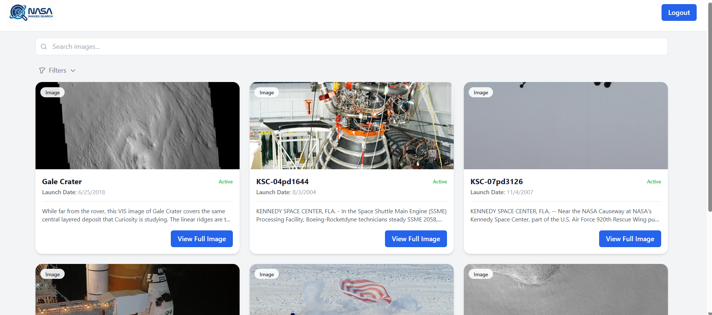
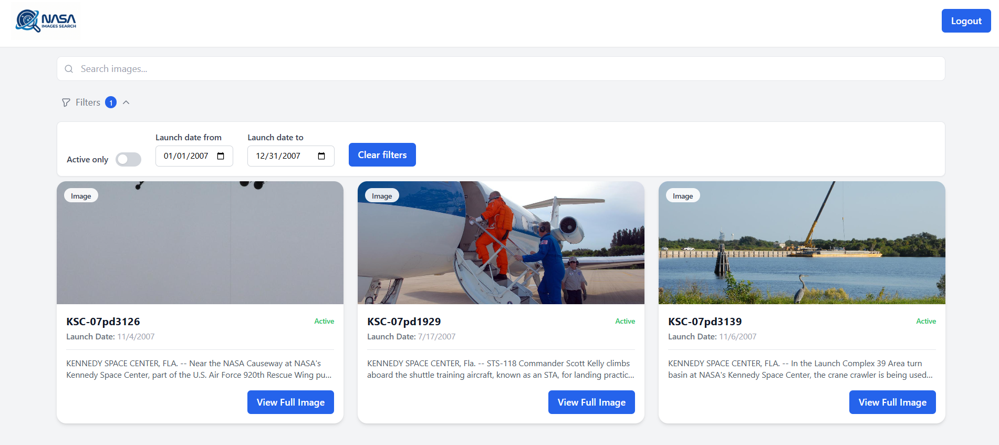

### Production Mode

Build and run the entire application with a single command:

```bash
docker compose up --build
```

## Cool Feature
  1. **Feature name**: Advanced Filtering System
  2. **Why this feature**: Large datasets can be difficult to navigate. This feature allows users to quickly isolate specific data points, such as active cameras or specific date ranges, improving overall usability and efficiency.
  3. **Implementation details**: Built using a generic architecture to ensure the filtering logic is highly extensible, making it easy to add new filter criteria in the future without refactoring.
  4. **Demo**: 
  
  